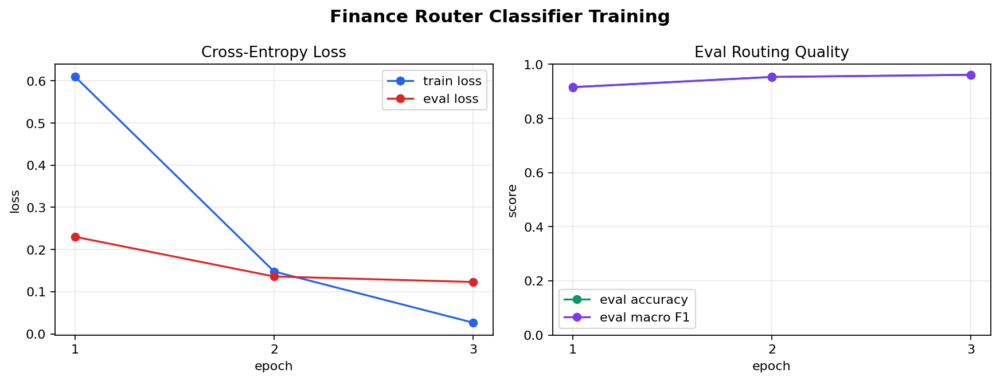

# Finance Router Training Report

## Final Eval

- Device: `mps`
- Train rows: `4000`
- Eval rows: `1000`
- Global steps: `3000`
- Eval accuracy: `0.961`
- Eval macro F1: `0.961`
- Eval loss: `0.123`

## Epoch History

| epoch | step | train loss | eval loss | eval accuracy | eval macro F1 |
| ---: | ---: | ---: | ---: | ---: | ---: |
| 1 | 1000 | 0.6102 | 0.2302 | 0.9150 | 0.9156 |
| 2 | 2000 | 0.1479 | 0.1361 | 0.9530 | 0.9533 |
| 3 | 3000 | 0.0265 | 0.1230 | 0.9610 | 0.9610 |
